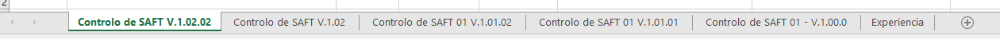

Usefull Links:

Populating Word templates with python:

https://pbpython.com/python-word-template.html

Word converter to HTML:

https://github.com/mwilliamson/python-mammoth

Automating windows APP usin COM:

https://pbpython.com/windows-com.html
https://gist.github.com/vinovator/0a6d653c22c32ab67e11
http://samloves.coffee/guides/portfolio/Python-Outlook-Automation/

Pandas:

https://pandas.pydata.org/pandas-docs/stable/reference/api/pandas.read_excel.html
https://openpyxl.readthedocs.io/en/stable/

Write to Excel

pandas.ExcelWriter — pandas 1.2.2 documentation
https://pandas.pydata.org/pandas-docs/stable/reference/api/pandas.ExcelWriter.html#pandas.ExcelWriter

pandas.DataFrame.to_excel — pandas 1.2.2 documentation
https://pandas.pydata.org/pandas-docs/stable/reference/api/pandas.DataFrame.to_excel.html

Writing to an excel sheet using Python - GeeksforGeeks
https://www.geeksforgeeks.org/writing-excel-sheet-using-python/

Reading and Writing Excel Files in Python with the Pandas Library
https://stackabuse.com/reading-and-writing-excel-files-in-python-with-the-pandas-library/

# Regras

## Excel

Ao criar um novo "sheet", guardar mais a direita

# read mails
https://stackoverflow.com/questions/22813814/clearly-documented-reading-of-emails-functionality-with-python-win32com-outlook/39911751